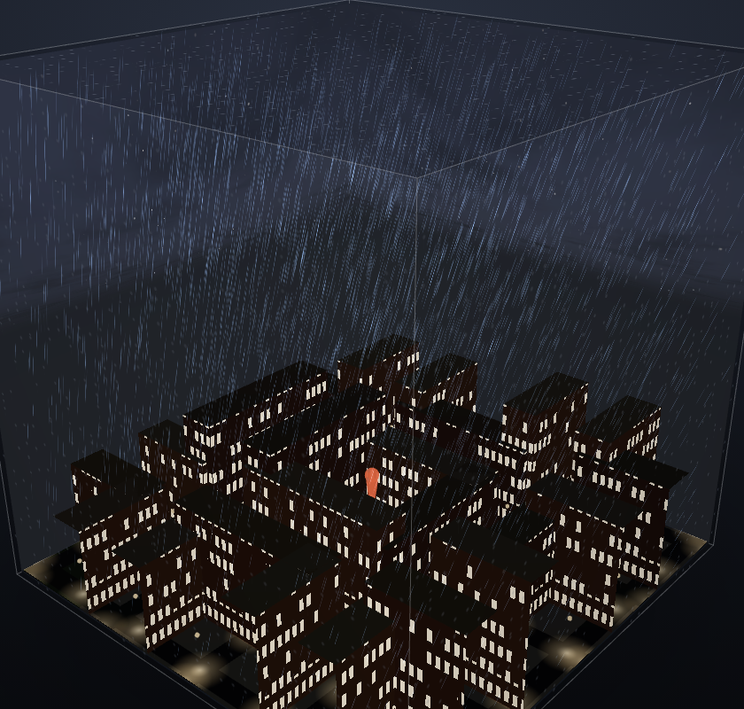

# Weather Cube

Type an address, get a glass cube containing that place — its buildings, its
street layout, its sky — under the weather that is happening there right now.



The cube can be filled two ways:

**Street View** — four Google Street View walls at north, east, south and west
plus the road surface underfoot, taken from the panorama nearest the address.
This is the mode where you recognise your own front door. Needs a Google Maps
Platform key.

**3D block model** — the actual building footprints around the address,
extruded from OpenStreetMap, with the real street network, courtyards, parks
and street trees. Needs no key at all, so it is what loads by default.

Either way the weather is the same simulation: real conditions from Open-Meteo,
a sun and moon placed by astronomical position for that latitude, longitude and
minute, and rain, snow, fog, cloud, wind and lightning driven by the actual
numbers.

---

## Running it

It is a static site with no build step. Because it uses ES modules it has to be
served over HTTP rather than opened from the filesystem.

```bash
npm start          # http://localhost:8000  (python3 -m http.server)
```

or any static server you like — `npx serve`, `caddy file-server`, nginx.

Three.js is vendored in `vendor/`, so the site works with no package install
and no CDN.

## Using it

1. Type an address and press **Build cube**, or press **Use my location**.
2. The block model appears immediately.
3. To switch to photographs, open **Google Street View key**, paste a key, and
   press **Street View**.

Controls: drag to orbit, scroll to zoom — zoom right in and you are standing
inside the cube. `h` hides the panels, `r` toggles auto-rotate. **Save PNG**
writes out the current frame.

The **Hour** slider walks ±24 hours through the real hourly forecast, so you
can watch your street move from this morning's fog into tonight's clear sky.
**Simulate a different sky** replaces the forecast with a named condition —
useful for seeing your own street in weather it is not currently having. The
readout says plainly when what you are looking at is simulated rather than
live.

## The Google Maps Platform key

Street View imagery needs a browser key with the **Street View Static API**
enabled, on a project with billing set up. The key is kept in `localStorage`
in your browser and sent only to Google.

Each cube costs **five image requests** (four walls plus the ground) and one
metadata request, which Google does not bill. Restrict the key by HTTP
referrer before you put it anywhere public.

If Street View has no coverage within 80 m of the address, the app says so and
stays on the block model.

## URL parameters

`?q=Calle+del+Mar+26,+Valencia&lat=39.4738&lon=-0.3743&mode=model&sky=rain&heading=0`

| key | meaning |
| --- | --- |
| `lat`, `lon` | the point to model; skips geocoding |
| `q` | label shown for that point |
| `mode` | `model` or `photo` |
| `sky` | a simulated condition (`clear`, `overcast`, `fog`, `rain`, `storm`, `snow`, …) |
| `heading` | rotate which compass bearing the panorama walls sit on |

**Copy link** writes the current state into the URL.

---

## How the simulation works

`src/climate.js` is the single place where a weather reading becomes render
parameters. Everything downstream — sky, particles, lighting, the wet look on
the road — reads from that one object, so the sky and the rain can never
disagree about what the weather is.

**Sun and moon** (`src/sun.js`) use the NOAA solar position algorithm, so the
sun sits where it actually sits over that address at that minute, and the
shadows in the model fall the right way. Twilight is treated as the long,
bright thing it is: the street stays readable to about 6° below the horizon
and is only properly dark by 16°.

**Sky** (`src/glsl.js`) is one GLSL function shared by the skybox, the glass
shell's reflections and the Street View walls. Cloud cover remaps a two-layer
fBm deck between an empty sky and a solid ceiling; the deck drifts with the
real wind vector. Stars are placed in cells on a sphere so they stay round.

**Fog** is the part most likely to be got wrong. Visibility is reported in
metres, but the cube only spans about 150 m, so visibility is first converted
to an extinction coefficient (Koschmieder, `k = 3.912 / V`) and then applied
across the cube's real size. A 4 km-visibility rainy afternoon barely dims the
far side of the block, which is correct; 200 m fog swallows it, which is also
correct.

**Precipitation** (`src/weatherfx.js`) advances entirely on the GPU — instance
positions are a function of time, wind and a per-instance seed — so heavy rain
costs the same as drizzle. Rain streaks lie along their own velocity vector and
tilt with the wind; snow sways; a dry gale lifts dust instead.

**Street View relighting** (`PHOTO_FRAG` in `src/glsl.js`) is the interesting
one. A photograph is fixed weather, so the shader takes it apart: sky pixels
are detected by blueness and brightness above the horizon and replaced with the
simulated sky, so the photographed sky can storm over. Rain darkens and
saturates the lower frame and rings the ground panel with ripples; night
crushes the image and lets the brightest pixels — lamps, shopfronts, lit
windows — glow back through; snow settles on the upward-facing half.

**The block model** (`src/modelcity.js`) extrudes each footprint using
`height`, or `building:levels × 3.2 m`, or a 15 m guess for European blocks.
Heights are exaggerated 2× because a true-to-scale 150 m box of air is mostly
empty sky. Facades get a real-metre window grid — recessed glazing by day, lit
windows after dark, more of them on ground floors — and street lamps are spaced
along the real road centrelines, so a night cube shows the shape of the actual
neighbourhood.

## Data sources

| what | who | key needed |
| --- | --- | --- |
| Weather | [Open-Meteo](https://open-meteo.com) | no |
| Geocoding | [Nominatim](https://nominatim.openstreetmap.org) / OpenStreetMap | no |
| Buildings, roads, trees | [Overpass](https://overpass-api.de) / OpenStreetMap | no |
| Street View imagery | Google Maps Platform | yes |

All requests go straight from the browser. There is no server, and nothing is
logged anywhere.

Nominatim and Overpass are volunteer-run and rate-limited; be gentle with them.

## Testing

```bash
npm test
```

Serves the site, stubs every third-party call with fixtures, and renders a
sweep of weather states to `shots/` — clear, overcast, rain, storm, snow, fog,
night, dusk — plus one view of each Street View wall from inside the cube,
which is how the panorama orientation is checked (facing north, east must be on
the right). It fails on any console error.

Fixtures are synthetic and are labelled as such; they are not real data for any
real address.

## Layout

```
index.html          shell and controls
styles.css
src/
  main.js           wiring, UI, render loop
  data.js           every network call
  climate.js        weather reading -> render parameters
  sun.js            solar and lunar position
  glsl.js           shared sky, and the Street View relighting shader
  cube.js           the six interior panels, glass shell, frame
  modelcity.js      OpenStreetMap footprints -> extruded block
  weatherfx.js      rain, snow, drift, ground fog, lightning
  panorama.js       Street View panel loading
  overrides.js      the named simulated conditions
tools/              offline smoke test and its fixtures
vendor/three/       pinned three.js r169
```
